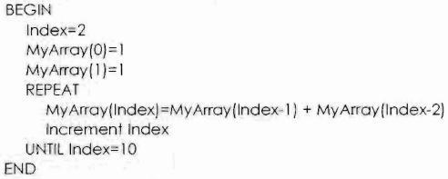
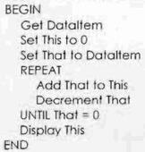

# Node tasks

## Task 1

1. Write a program that reads in two numbers from the console and adds them up. Print the result to the console.

[Sample solution] (https://github.com/stlukesdy/yr11sdd2015_node/blob/master/teacher/node_tasks/task1/program.js)

## Task 2

1. Write a js program that creates a sequence of numbers according to the following pseudocode:

[Sample solution] (https://github.com/stlukesdy/yr11sdd2015_node/blob/master/teacher/node_tasks/task2/program.js)
  

## Task 3

Write a js program for the following algorithm, use better variable names.

## Task 4

Create a js function that takes 'HighIndex' as input parameter and creates and Array that as every value set to its index.

